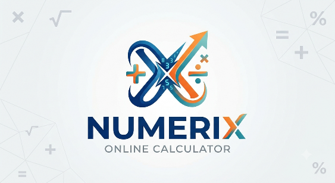

# Professional Accountant Calculator

A high-precision, desktop-grade financial and accounting calculator application tailored for accountants, auditors, and office professionals. Designed for speed, keyboard ergonomics, precision numeric handling, 20-line tape audit history, Excel `.xlsx` and PDF report generation, analog clock, and custom organization branding.

---

## 🌟 Key Features

- **Accurate Decimal Engine**: High-precision 32-digit decimal calculation via `Decimal.js`, avoiding standard IEEE floating-point errors (e.g. `0.1 + 0.2`).
- **20-Line Paper Tape / Audit History**: Real-time record of all mathematical expressions, timestamps, operations, and intermediate results. Supports line reuse, single-item copying, and clearing.
- **Configurable 3-Digit Number Formatting**:
  - `1,234,567.89` (Standard US/UK/International)
  - `1.234.567,89` (European / Latin)
  - `1 234 567.89` (International SI)
  - `1'234'567.89` (Swiss Accounting)
- **Decimal Precision Controls**: Instant `DEC −` and `DEC +` buttons to adjust precision dynamically (0 to 8 places).
- **Accounting & Tax Functions**:
  - `TAX+` (Add tax percentage)
  - `TAX−` (Extract pre-tax net amount from gross)
  - `MU%` (Markup on cost)
  - `MAR%` (Gross margin selling price)
  - `DISC` (Discount percentage)
  - Memory Registers (`MC`, `MR`, `M+`, `M−`, `MS`) with on-display indicator `[M = ...]`
  - Grand Total (`GT`) and Subtotal (`ST`)
- **Excel & Spreadsheet Integration**:
  - One-click client-side export to formatted Excel `.xlsx` workbook with columnar metadata and summary statistics.
  - **Copy for Excel (TSV)**: Paste directly into Excel columns with `Ctrl+V`.
  - **Raw # Copy**: Copy unformatted numbers without commas for raw calculation formulas.
- **Accountant-Grade PDF Audit Reports**:
  - Generates downloadable, print-ready PDF reports with organization branding, date/time, structured audit table, and official sign-off footer.
- **Analog Clock & Live Date**: Real-time analog clock with smooth second hand and local calendar date.
- **Custom Branding & Logo Upload**: Upload custom company logo (PNG, JPG, SVG, WebP) stored client-side.
- **Subtle Keystroke Audio**: Non-fatiguing Web Audio synthesized feedback with toggle and volume controls.
- **Docker Deployment on Port 9330**: Production-ready containerized deployment.

---

## 🚀 Docker Deployment

The application is pre-configured to run in Docker and bind to **port 9330**.

### Method 1: Using Docker Compose (Recommended)

1. Clone the repository or navigate to the application folder:
   ```bash
   cd accountant-calculator
   ```

2. Start the container in detached mode:
   ```bash
   docker compose up -d --build
   ```

3. Access the calculator in your browser:
   ```text
   http://SERVER-IP:9330
   ```

### Method 2: Using Docker CLI

1. Build the Docker image:
   ```bash
   docker build -t iooc-accountant-calculator .
   ```

2. Run the container on port 9330:
   ```bash
   docker run -d --name accountant-calculator -p 9330:9330 --restart unless-stopped iooc-accountant-calculator
   ```

3. Open `http://localhost:9330` in your web browser.

---

## ⚙️ Custom Port Configuration

To change the default port from `9330` to another port (e.g. `8080`):

### With Docker Compose:
Set the `PORT` environment variable before running `docker compose`:
```bash
PORT=8080 docker compose up -d
```
Or create a `.env` file:
```env
PORT=8080
```

### With Docker CLI:
```bash
docker run -d --name accountant-calculator -e PORT=8080 -p 8080:8080 iooc-accountant-calculator
```

---

## 🔄 Updating the Container

To update the running container with the latest codebase:

```bash
docker compose down
docker compose pull
docker compose up -d --build
```

---

## ⌨️ Keyboard Shortcuts Cheatsheet

| Key / Shortcut | Action |
|---|---|
| `0 – 9`, `.` | Enter digits and decimal point |
| `+`, `−`, `*`, `/` | Basic arithmetic operators |
| `Enter` or `=` | Execute calculation & record to tape |
| `Escape` | **AC** (All Clear) – Reset calculation |
| `Delete` | **CE** (Clear Entry) – Clear current input |
| `Backspace` | Erase last typed character |
| `%` | Calculate percentage |
| `(`, `)` | Parentheses for nested order of operations |
| `[` / `]` | Decrease / Increase decimal places (`DEC −` / `DEC +`) |
| `T` | **TAX+** (Add configured Tax %) |
| `Shift + T` | **TAX−** (Deduct Tax % from Gross) |
| `M` / `Shift + M` | **M+** (Memory Add) / **M−** (Memory Subtract) |
| `R` | **MR** (Memory Recall) |
| `C` | **MC** (Memory Clear) |
| `G` | **GT** (Grand Total) |
| `S` | **ST** (Subtotal) |
| `F1` or `?` | Open Help & Keyboard Guide |

---

## 📊 Excel & PDF Export

### Excel Export (`.xlsx`)
- Click **"Export .XLSX"** in the top bar or tape footer.
- Generates a structured spreadsheet containing Line #, Date, Time, Expression, Numeric Result, Formatted Result, and Operation Type.
- Includes automatic summary formulas: Sum of Results, Average, Max, and Min.

### PDF Report
- Click **"PDF Report"** in the top bar or tape footer.
- Creates an A4 accountant audit report with header branding, company metadata, tabular calculation history, summary metrics, page numbers, and official sign-off footer.

---

## 💾 Local Storage & Backup Considerations

- All calculation records, custom logos, and user preferences (theme, decimal places, tax rate) are stored **100% locally in the browser** (`localStorage` / `IndexedDB`).
- **No external server or database connection is required** during normal operation.
- To back up your calculation history, use the **"Export .XLSX"** or **"Copy for Excel"** function before clearing browser cache.

---

## 🔧 Troubleshooting

| Issue | Resolution |
|---|---|
| Port 9330 is already in use | Change port using `PORT=YOUR_PORT docker compose up -d`. |
| Sound effects not playing | Click anywhere inside the application to initialize the browser's Web Audio context, or check the Sound toggle in the top bar. |
| Numbers showing unexpected decimal places | Use the `DEC −` and `DEC +` buttons or press `[` and `]` to adjust the precision. |
| Logo appears distorted | Upload standard aspect ratio images (PNG, JPG, SVG, WebP) under 2MB. |

---

## 🏢 Organization & Credits

- **Organization**: IOOC-ShirazOffice
- **Developer / Author**: By: N.Shaaeri
- **License**: Proprietary / Office Enterprise
